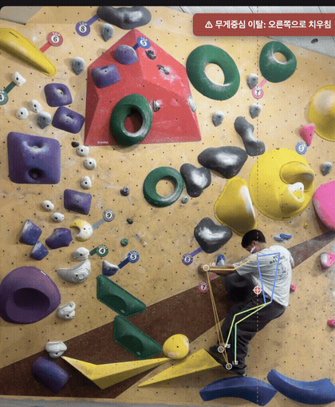

# 클라이밍 무게중심 분석기

클라이밍 영상(웹캠 또는 파일)에서 손·발·몸통 등 신체 부위를 실시간으로 인식하고, 인체 분절 질량비 기반으로 무게중심(COM)을 계산해 지지 기반(손/발)을 벗어나면 즉시 알려주는 웹 앱입니다. 별도 설치나 빌드 없이 브라우저에서 바로 동작합니다.



*실제 클라이밍 영상을 앱에 업로드해 분석한 화면입니다. 상단 컨트롤, 스켈레톤·무게중심(중앙 십자 표시)·지지 기반 폴리곤이 표시된 캔버스, 하단 상태 패널(균형 상태/지지 기반/안정도/FPS)까지 전체 UI를 볼 수 있습니다.*

## 라이브 데모

**https://feelgom.github.io/climbing-balance-analyzer/**

GitHub Pages는 HTTPS로 서비스되므로 웹캠 실시간 분석도 별도 설정 없이 바로 사용할 수 있습니다.

## 기능

- **신체 부위 인식**: MediaPipe Pose Landmarker로 손목·팔꿈치·어깨·엉덩이·무릎·발목 등 33개 지점을 추적하고, 몸통/팔/다리/얼굴을 색상으로 구분해 스켈레톤으로 표시
- **무게중심(COM) 계산**: 단순 골반 중심이 아니라 Winter/Dempster 인체측정학 표의 분절별 질량 비율(머리 8.1%, 몸통 49.7%, 팔·다리 각 분절 등)로 가중 평균한 실제 무게중심을 매 프레임 계산
- **지지 기반 추정**: 손목/발목이 여러 프레임 동안 거의 정지해 있으면 "홀드를 잡고 있는 중"으로 판단해 지지점으로 채택(히스테리시스 적용으로 순간적인 흔들림에 오탐하지 않음). 지지점들의 컨벡스 헐(convex hull)을 지지 기반 폴리곤으로 사용
- **균형 이탈 경고**: 무게중심의 수직 투영선이 지지 기반을 벗어나면 배너·색상 변화로 시각 경고, 선택적으로 경고음 재생
- **입력 방식**: 웹캠 실시간 분석 / 영상 파일 업로드 두 가지 모두 지원
- **모델 선택**: Lite(빠름) / Full(균형) / Heavy(정밀, 느림) 중 정확도-속도 트레이드오프 선택 가능

## 사용된 모델과 기술

- [MediaPipe Tasks Vision – Pose Landmarker](https://ai.google.dev/edge/mediapipe/solutions/vision/pose_landmarker) (`@mediapipe/tasks-vision`, CDN을 통해 브라우저에서 WASM으로 실행, 서버 불필요)
- 순수 HTML/CSS/JavaScript (ES 모듈), 빌드 도구나 프레임워크 없음
- 무게중심 계산: Winter/Dempster 인체 분절 질량비 기반 가중 평균
- 지지 기반 판정: 프레임 간 이동량 기반 정지 상태 감지 + 히스테리시스 + 컨벡스 헐(Andrew's monotone chain)

## 로컬 실행 방법

`getUserMedia`(웹캠 접근)는 보안 컨텍스트(HTTPS 또는 localhost)에서만 동작하므로, `file://`로 직접 열지 말고 로컬 서버로 실행하세요.

```bash
git clone https://github.com/feelgom/climbing-balance-analyzer.git
cd climbing-balance-analyzer
python3 -m http.server 8000
```

브라우저에서 `http://localhost:8000` 접속 후 "웹캠 실시간 분석 시작" 버튼을 눌러 카메라 권한을 허용하면 됩니다. 영상 파일 업로드 모드는 `file://`로 직접 열어도 동작합니다.

## 한계 및 주의사항

- 단일 카메라의 2D 투영을 기반으로 한 근사치입니다. 벽이 많이 오버행되어 있거나 카메라가 비스듬히 설치된 경우 실제 3차원 무게중심과 오차가 커질 수 있습니다.
- 지지 기반 판정은 손목/발목의 정지 여부로 추정하며, 실제 홀드 위치나 파지력을 인식하지는 않습니다.
- 의료·재활 목적의 정밀 분석 도구가 아닌, 클라이밍 자세 참고용 도구입니다.
